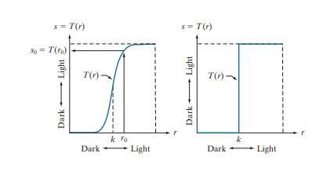
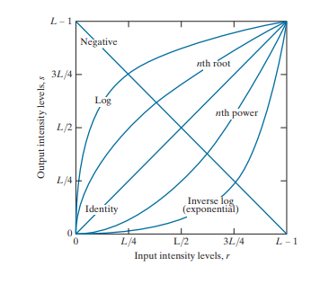
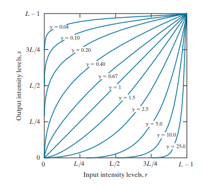

<h2 align="center">Ch 3. 밝기 변환과 공간 필터링</h2>

## 프리뷰
:clipboard: __단어__ :clipboard:<br/>
```
Spatial Domain : 공간 도메인
image plane : 영상 평면
direct maniplation : 직접 조작
transform domain : 변환 도메인 (챕터4, 6)
inverse transform : 역변환
intensity transformation : 밝기 변환
spatial filtering : 공간 필터링
contrast manipulation : 콘트라스트(대비?) 조작
image tresholding : 영상 문턱치 처리
smoothing : 스무딩
sharpening : 샤프닝
```
<br/>

__기억해야 하는 것__
- 공간 도메인 처리(Processing)와 변환 도메인 처리의 차이를 이해한다.
- 밝기 변환에 사용되는 주요 기술들에 익숙해진다.
- 영상 히스토그램의 물질적인? 의미와 그것이 어떻게 영상 향상을 위해 조작될 수 있는지 이해한다.
- 공간 필터링의 기술들과 공간 필터링이 어떻게 형성되는지 이해한다.
- 공간의 회선?(Convolution)과 상관관계 원칙을 이해한다.
- 공간 필터의 주요 타입을 알고 그것들이 어떻게 쓰이는지 이해한다.
- 공간 필터와 저역 통과 필터?(Low pass filter)의 근본적인 역할의 관계를 안다.
- 단일 접근?(Single Approach)가 불충분할 경우 개선 메소드?(Enhancement Methods)의 조합을 사용하는 방법을 이해한다.<br/><br/>

## 3.1 배경
### 3.1.1 밝기 변환과 공간 필터링의 기초<br/>
:clipboard: __단어__ :clipboard:<br/>
```
implement : 구현하다
elementwise : 요소별
implementation : 구현
operator : 연산자
rectangular : 사각형
```
<br/>


:memo: __정리__ :memo:<br/>
챕터 3에서 논의되는 모든 영상 처리 기법들은 단순히 영상의 화소들을 포함하는 평면인 공간 도메인에서 구현된다.<br/>
공간 도메인 기법은 영상의 화소에 직접 작용한다.<br/>
공간 도메인 기법들은 계산이 더 효율적이며, 구현에 더 적은 프로세싱 자원이 소요된다.<br/><br/>

이웃의 최소 크기는 1 x 1이다.<br/>
연산 순서는 입력 영상의 왼쪽 위에서부터 수평 방향으로 한 화소씩, 한번에 한 행씩 진행한다.<br/>
이웃의 원점이 영상의 경계에 있을 경우, 이웃의 일부가 바깥에 존재하게 되는데 이는 무시하거나, 0 또는 지정된 밝기 값들의 경계로 영상을 패딩하여 계산한다.<br/><br/>

이웃의 크기가 1 x 1일 경우 g(x, y) = T[f(x, y)] 식은 s = T(r) 식이 된다. s와 r은 각각 g(x, y)와 f(x, y)의 밝기 변수이다.<br/><br/>

<p align = "center">
  <br/>
  <I>그림 3.2</I>
</p>
콘트라스트 스트레칭(좌측) : k보다 낮은 r값(밝기 변수)은 변환 함수에 의해 흑색 쪽으로, 높은 r값은 백색 쪽으로 s의 좁은 범위에 압축된다.<br/>
문턱치 처리(우측) : 콘트라스트 스트레칭과 유사하지만 더욱 극단적이다.<br/><br/>


### 3.1.2 이 장의 예제들에 관하여<br/>
:clipboard: __단어__ :clipboard:<br/>
```
span : 닿다.
broad range : 광범위한
infrared : 적외선
interpretation : 해석

new comers : 신규 이민자?
```
<br/>


:memo: __정리__ :memo:<br/>
개선 : 특정 응용을 위해 결과가 원래 영상보다 더 적합하게 되도록 영상을 조작하는 프로세스<br/>
특정 : 개선 기법이 문제 지향적임을 확고히 하기 때문<br/><br/>


## 3.2 기본적 밝기 변환 함수들
:clipboard: __단어__ :clipboard:<br/>
```
denote : 나타내다.
```
<br/>

:memo: __정리__ :memo:<br/>
밝기 변환은 영상 처리 기법 중 가장 간단한 축에 든다.<br/>
처리 전 후의 화소 값들은 각각 r과 s로 표기된다.<br/>
s = T(r) 식에서 T는 화소 값 r을 화소 값 a로 매핑하는 변환이다.<br/>
변환 함수의 값은 일반적으로 1-D 배열에 저장된다.<br/>
r에서 s로의 매핑은 테이블 룩업(표 검색)에 의해 구현된다.<br/>
8 비트 환경에서 T의 값들을 담고 있는 룩업 테이블은 256개의 요소를 가질 것이다.<br/><br/>

<p align = "center">
  <br/>
  <I>그림 3.3</I>
</p>
영상 개선을 위해 자주 사용되는 세 가지 기본 함수 유형 : 선형(네거티브 및 항등 변환들), 로가리듬(로그 및 역로그 변환들), 거듭제곱-법칙(또는 멱승-법칙. n차 거듭제곱 및 n차 제곱근 변환들)<br/><br/>


### 3.2.1 영상 네거티브<br/>
:clipboard: __단어__ :clipboard:<br/>
```

```
<br/>

:memo: __정리__ :memo:<br/>
밝기 레벨의 범위가 [0, L, -1]인 영상의 네거티브는 다음 식과 같다.<br/>
s = L - 1 - r<br/>
네거티브 처리는 특히 흑색 영역의 면적 비중이 클 때, 영상의 어두운 영역에 놓여 있는 흰색이나 그레이 디테일을 개선시키는 데 적합하다.<br/><br/>

### 3.2.2 로그 변환<br/>
:clipboard: __단어__ :clipboard:<br/>
```
dominate : 억누르다.
```
<br/>

:memo: __정리__ :memo:<br/>
로그 변환의 일반형은 다음과 같다.<br/>
s = clog(1 + r)<br/>
c는 상수이며 r>=0으로 가정한다.<br/>
그림 3.3을 보았을 때, 로그 변환이 입력 밝기 레벨이 낮은 값들의 좁은 범위를 넓은 범위의 출력 레벨로 매핑한다는 것을 알 수 있다.<br/>
입력 밝기 레벨이 높은 값들은 그렇지 않다.<br/>
입력의 어두운 화소들의 값을 신장(전보다 더 커지거나 늘어나게 한다.)시키고, 높은 레벨의 값들을 압축하고자 할 때 로그 변환을 사용한다.<br/>
역로그 변환은 로그 변환과 반대되는 특성을 가진다.<br/><br/>

로그 변환은 화소 값등릐 편차가 큰 영상의 동적 범위를 압축하는데 중요한 특성을 가진다. <br/>

### 3.2.3 거듭제곱-법칙(Gamma) 변환<br/>
:clipboard: __단어__ :clipboard:<br/>
```
Power-law : 거듭제곱
```
<br/>

:memo: __정리__ :memo:<br/>
거듭제곱-법칙의 일반형은 다음과 같다.<br/>
s = c(r^γ)<br/>
c와 r은 양의 상수이다.<br/>
오프셋(입력이 0인데 측정되는 출력)을 감안하기 위해 때때로 s = c(r + ε)^γ로 쓴다.<br/><br/>

<p align = "center">
  <br/>
  <I>그림 3.6</I>
</p>
γ 값이 1보다 작을 경우 로그 변환과 비슷하게 좁은 범위의 어두운 입력 값을 넓은 범위의 출력 값으로 매핑한다.
γ 값이 1보다 클 경우 역로그 변환과 비슷하다.
c = γ = 1일 때 항등 변환이 된다.

거듭제곱-법칙 반응 현상을 보정하는 프로세스를 gamma 보정이라 부른다.
적절하게 보정되지 않은 영상은 퇴색해 보이거나, 높은 가능성으로 너무 어둡게 보일 수 있다.
gamma 값을 바꾸면 밝기 뿐 아니라 칼라 영상의 적, 녹, 청의 비도 바뀌기 때문에 관련 지식이 어느 정도 필요하다.
gamma 보정은 디지털 영상의 사용이 증가함에 따라 중요해졌다.


### 3.2.4 구간 선형 변환 함수<br/>
:clipboard: __단어__ :clipboard:<br/>
```

```
<br/>

:memo: __정리__ :memo:<br/>
